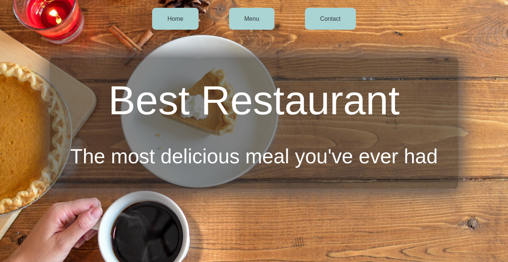

# Best Restaurant 

> This is the second project of Microverse JavaScript course.

> Best Restaurant!

## Description

In this project, a restaurant website is built.

All pages of this website are built by using DOM manipulation and rendering dynamically.

## Features

The website has three pages; main page, menu page and contact page.

## Built with

- Git
- HTML
- CSS
- JavaScript
- webpack

## Live demo

Please [check](https://raw.githack.com/ozovalihasan/restaurant-page/main-parts/dist/index.html).

## Setup

- Clone this repository
- Open terminal
- Change directory by using `cd restaurant-page/`
- Run `npm install`
- Run `npm run dev`
- Open your browser and go to http://localhost:8080 and open 'dist' folder

I suggest using VSCode as editor and [live server extenstion](https://marketplace.visualstudio.com/items?itemName=ritwickdey.LiveServer) for development.

## Authors

Reach out to me at one of the following places!

👤 **Hasan Özovalı**

- LinkedIn: [Hasan Ozovali](https://www.linkedin.com/in/hasan-ozovali/)
- Github: [@ozovalihasan](https://github.com/ozovalihasan)
- Twitter: [@ozovalihasan](https://twitter.com/ozovalihasan)
- Mail: [ozovalihasan@gmail.com](ozovalihasan@gmail.com)

## Contributing 🤝

Contributions, issues, and feature requests are welcome!

Feel free to check the [issues page](https://github.com/ozovalihasan/restaurant-page/issues).

## Acknowledgments

Thanks to

- [Microverse](http://microverse.org/) for its support.
- [Element5 Digital](https://unsplash.com/@element5digital), [Pineapple Supply Co.](https://unsplash.com/@pineapple), [Louis Hansel](https://unsplash.com/@louishansel), [Dennis Klein](https://unsplash.com/@klein2) and [Ella Olsson](https://unsplash.com/@ellaolsson) for their amazing photos.

## Show your support

Give a ⭐️ if you like this project!

## License

- **[MIT license](http://opensource.org/licenses/mit-license.php)**
